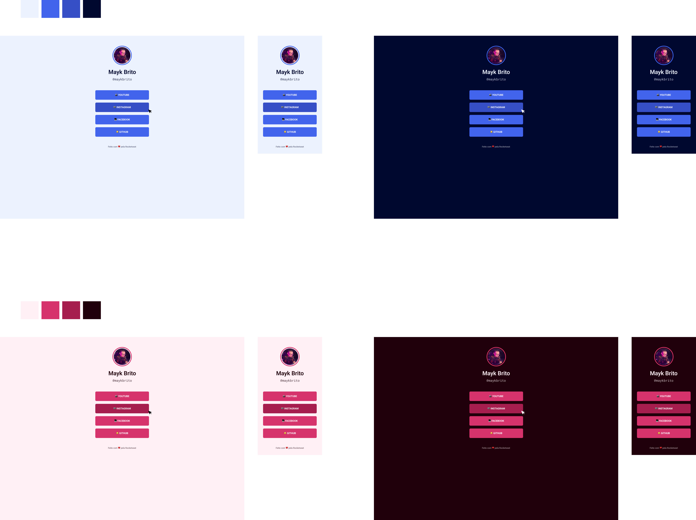

<h1 align="center">
	Linktree
</h1>

<h3 align="center">
	Project created based on Linktree
</h3>

	
    

<h4 align="center">
	Status: 🚀 Finished
</h4>

	<a href="#about">About</a> •
	<a href="#tech-stack">Tech Stack</a> •
	<a href="#usage">Usage</a> • 
	<a href="#contact">Contact</a> 

  

## About

EN = Project created in Rocketseat's Marathon Explorer 2.0 it aims to create just one link to several links, since other social networks only let you put a link on the profile, it was based on the Linktree platform.

PT = Projeto criado na Maratona Explorer 2.0 da Rocketseat ele tem como objetivo criar apenas um link para diversos links, já que outras redes sociais apenas deixam colocar um link no perfil, ele foi baseado na plataforma Linktree.

## Tech Stack

&nbsp;
&nbsp;

## Usage

To use this project, go to the link:

[Link Project](https://igorsilvamedeiros.github.io/Linktree/)

## Layout

In the link below you will find the layout of the web/mobile project. Remembering that you need to have a [Figma](http://figma.com/) account to access it.

[Layout Web/Mobile](<https://www.figma.com/file/sdHNxYxYs7bKXWeKI0UG9f/Rocket-Links---Maratona-Explorer-2.0-(Community)-(Copy)?node-id=0%3A1>)

## Contact

Made with ❤️ by [Igor da Silva](https://github.com/IgorSilvaMedeiros), get in touch!

&nbsp;
&nbsp;

 
